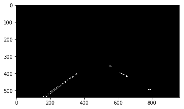

# Project 1: Finding Lane Lines on the Road

# Code and Writeup

## Overview

When we drive, we use our eyes to decide where to go.  The lines on the road that show us where the lanes are act as our constant reference for where to steer the vehicle.  Naturally, one of the first things we would like to do in developing a self-driving car is to automatically detect lane lines using an algorithm.

In this project I detected lane lines in images using Python and OpenCV.  OpenCV means "Open-Source Computer Vision", which is a package that has many useful tools for analyzing images.  
## Lane Finder Discussion

The major shortcomings with this lane finder are numerous:
1.	It can only provide meaningful information to a self-driving car on a highway with fully controlled access (fewer than 5% of U.S. roads fit this definition)
2.	It cannot detect objects in front of or around the vehicle which means it cannot determine when to slow down or stop
3.	It cannot provide input to a self-driving car entering or exiting a highway
4.	It cannot assist a self-driving car in changing lanes
5.	It cannot assist a self-driving car on roads under repair
6.	It may not be able to assist a self-driving car on poorly maintained highways
7.	It cannot assist a self-driving car during inclement weather (especially snow storms)

Serious improvements to lane detection can be realized through the incorporation and utilization of more advanced technologies:
1.	More video sensors and more types of sensors
2.	Better Cameras (3D)
3.	Integrated Radar (Advanced Driver Assistance Systems)
4.	LIDAR (3D object detection)
5.	Vehicle to Everything Communication
6.	Smart Infrastructure
7.	Development of the software necessary to integrate these sensor systems

## Result of Filtering, Averaging and Extrapolation

This pipeline has been implemented using the helper functions and other code to roughly identify the left and right lane lines with line segments and solid lines.  In addition, detected line segments have been filtered, averaged and extrapolated to map out the full extent of the left and right lane boundaries.

## 1. Original Image
### test_images\solidYellowCurve2.jpg

## 2. Region of Interest
 This filter masks everything except the lane.

## 3. Color Filter
 This filter masks everything except yellow and white colors.

## 4. Gaussian Blur
 This algorithm removes sharp edges.

## 5. Canny Edges
 This algorithm detects only edges.

## 6. Hough Lines
 This algorithm converts edges into lines.

## 7. Extrapolated Lines
 This algorithm extrapolates lines and uses moving average and sanity checking algorithms to eliminate frame jumping.

## 8. Original image with Lane shaded
### test_images\solidYellowCurve2.jpg

# Show Videos

The lanes have been detected on all the video clips provided with the project.
