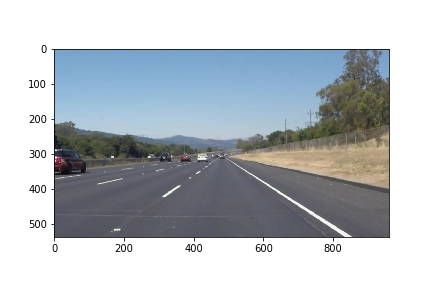
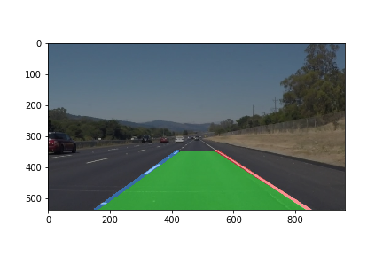
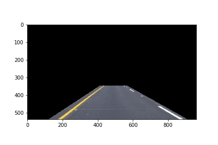
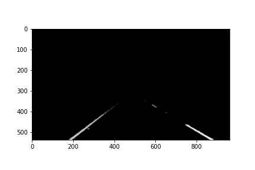
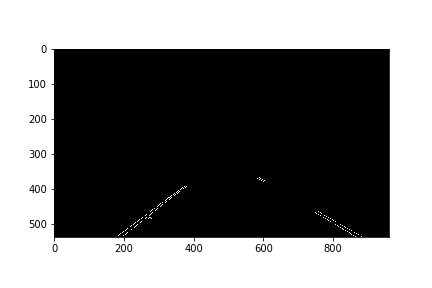
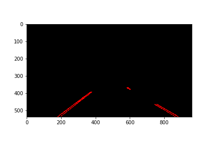
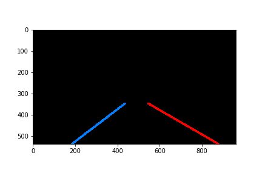
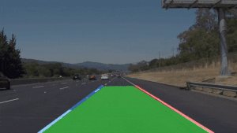
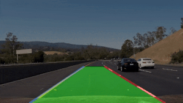

Project 1, Term 1: Finding Lane Lines on the Road
=================================================

Required Files
--------------

#### Have all project files been included with the submission?

This git repository contains:
-   A Jupyter notebook with code, images and videos
-   A writeup report (markdown)

Lane Finding Pipeline
---------------------

#### Does the pipeline for line identification take road images from a video as input and return an annotated video stream as output?

My output video is an annotated version of the input video.

*Input*

*Output*

#### Has a pipeline been implemented that uses the helper functions and / or other code to roughly identify the left and right lane lines with either line segments or solid lines?

My pipeline identifies the left lane with a blue line and the right lane with a
red line. The space between the lines (a.k.a. the lane) is shaded green.

#### Have detected line segments been filtered / averaged / extrapolated to map out the full extent of the left and right lane boundaries?

Detected line segments have been filtered, averaged and extrapolated to map out
the full extent of the left and right lane boundaries:

##### 1. Original Image

test_images\whiteCarLaneSwitch.jpg

##### 2. Region of Interest

This filter masks everything except the lane.

##### 3. Color Filter

This filter masks everything except yellow and white colors.

##### 4. Gaussian Blur

This algorithm removes sharp edges.

##### 5. Canny Edges
 This algorithm finds edges.

##### 6. Hough Lines

This algorithm converts edges into lines.

##### 7. Extrapolated Lines

This algorithm extrapolates lines and uses moving average and sanity checking algorithms to eliminate frame jumping.

##### 8. Original image with Lane shaded

test_images\whiteCarLaneSwitch.jpg

Videos
----------

Solid White Right

Solid Yellow Left

Challenge

Reflection
----------

#### Has a thoughtful reflection on the project been provided in the notebook?

My reflection identifies potential shortcomings and suggests possible improvements:

The potential shortcomings with this lane finder are numerous:
1.  It can only find lanes on a highway with fully controlled access (fewer than
    5% of U.S. roads fit this definition),
2.  It cannot detect objects in front of or around the vehicle, so it cannot
    determine when to slow down or stop,
3.  It cannot assist a self-driving car entering or exiting a highway,
4.  It cannot assist a self-driving car in changing lanes,
5.  It cannot assist a self-driving car on roads under repair,
6.  It can only partially assist a self-driving car on poorly maintained
    highways,
7.  It cannot assist a self-driving car during inclement weather (especially
    snow storms).

Serious improvements to lane detection can be realized through the incorporation
and utilization of more advanced technologies:
1.  More video sensors and more types of sensors,
2.  Better Cameras (3D),
3.  Integrated Radar (Advanced Driver Assistance Systems),
4.  LIDAR (3D object detection),
5.  Vehicle to Everything Communication,
6.  Smart Infrastructure,
7.  Development of the software necessary to integrate these sensor systems.
